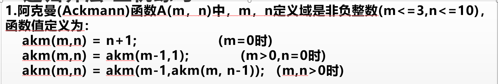
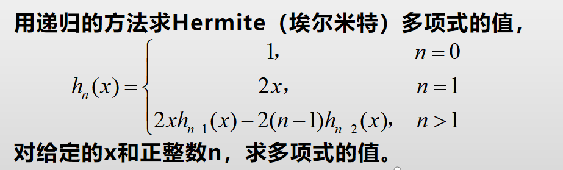

# 练习：（每次都会更新，请注意标注的日期）

## 2022-03-09：利用递归函数完成 ackman 函数。【阿克曼】

## 2022-03-19：利用递归函数完成 Hermite 函数。【埃尔米特】

## 20220405: 利用递归函数实现数学公式求解。

## 20220422: 利用 fopen() 和 freopen() 完成从文件输入输出。

## 20220427： 利用 fopen() 和 freopen() 改写”求菲波纳契数列的第n项”，